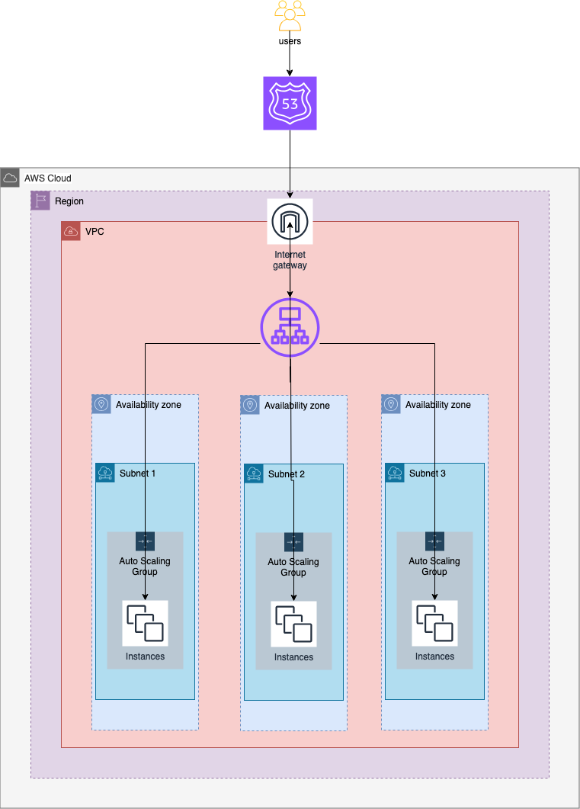

# Terraform AWS ALB Path Based Routing

>This is a Terraform project that deploys an ALB which uses path based routing, along with a VPC, ASG(for scaling instances) and Route 53 for managing domain name.

## Resources:
- Terraform
- AWS VPC
- AWS ALB
- AWS ASG
- AWS Route53

### ALB path based routing to auto scaling group instances

Path-Based Routing: Routing by paths is the mechanism of grouping multiple or all APIs under the same hostname, and using a request URI to isolate services; for example, `example.com/path1` or `example.com/path2`. For example, traffic to `example.com/path1` could be routed to a different target group than traffic to `example.com/path2`.

Using path-based routing on an Application Load Balancer allows you to host multiple microservices behind a single load balancer using listener rules and target groups. The instances are deployed via an Auto Scaling group for the purposes of automatic scaling and management. You can set up complex rules to route client requests to your applications.


When the Domain name is placed in a browser and depending on the path added to it, it will be redirected to certain websites
There are 3 routes: `/`, `/path1/` and `/path2/`


## Architecture Diagram


The Auto Scaling group also lets you use Amazon EC2 Auto Scaling features such as health check replacements and scaling policies. Both maintaining the number of instances in an Auto Scaling group and automatic scaling are the core functionality of the Amazon EC2 Auto Scaling service.

### Test the path-based routing

To test the path-based routing, copy the Domain name into a web browser, and then add the URL path `/path1/` or `/path2/`.

For example, suppose that your domain is `example.com`.

    http://example.com/ returns default service.
    http://example.com/path1/ returns service A.
    http://example.com/path2/ returns service B.

When the Application Load Balancer listener receives the request, the listener forwards that request to the appropriate target group based on the path condition.

>Note: Path-based routing rules look for an exact match. If your application requires requests to be routed further on these paths, then include a wildcard in the condition for the path-based routing rule. Use path patterns similar to `/path1*` or `/path2*` to account for any documents on these paths when routing requests.

## Cleanup
Remember to delete all AWS components afterwards to avoid unforseen bills.
```terraform
terraform destroy -auto-approve
```
